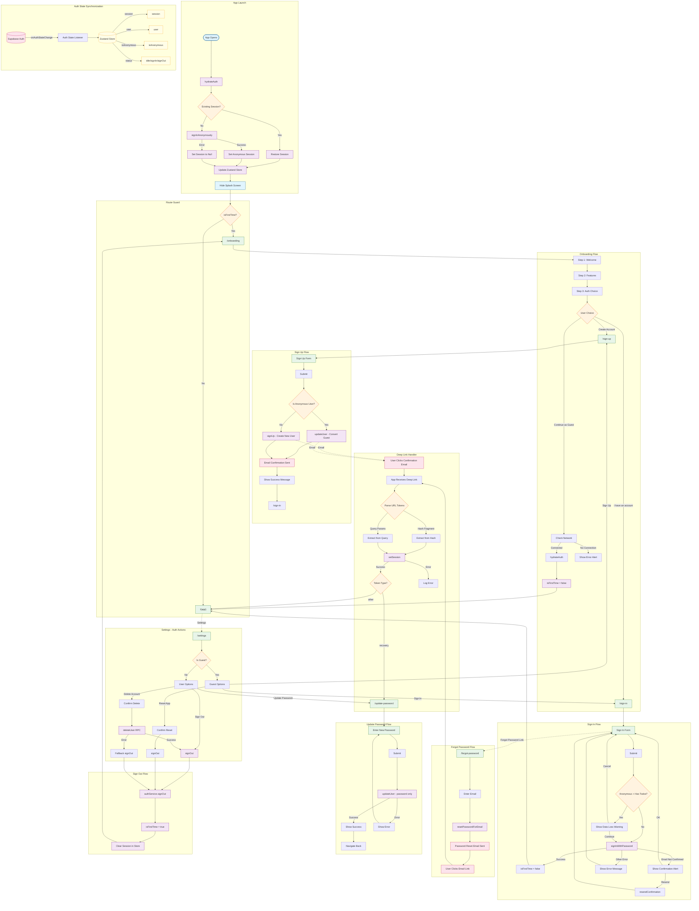

# Authentication Flow Diagram

This Mermaid diagram documents the complete authentication system as implemented in the app.

## Overview

The authentication system supports:

- **Anonymous (Guest) Sessions** - Automatic soft login for first-time users
- **Email/Password Authentication** - Standard registration and login
- **Guest-to-Registered Conversion** - Preserves user data when upgrading from guest
- **Email Confirmation** - Required for new accounts
- **Password Reset** - Email-based recovery flow
- **Deep Link Handling** - For email verification and password reset callbacks

## Complete Flow Diagram

## Key Components

### Auth Service (`src/lib/auth/auth-service.ts`)

Wraps Supabase auth methods with consistent `{ data, error }` return shape.

### Auth State (`src/lib/auth/index.tsx`)

Zustand store that maintains:

- `session` - Current Supabase session
- `user` - Current user object
- `isAnonymous` - Whether user is in guest mode
- `status` - `idle` | `signIn` | `signOut`

### Deep Link Handler (`src/lib/hooks/use-auth-deep-link.ts`)

Handles incoming auth callbacks from:

- Email confirmation links
- Password reset links

### API Hooks (`src/api/auth/`)

React Query mutations for each auth operation:

- `useLogin`
- `useSignUp`
- `useForgotPassword`
- `useUpdatePassword`
- `useDeleteUser`
- `useResendConfirmation`
